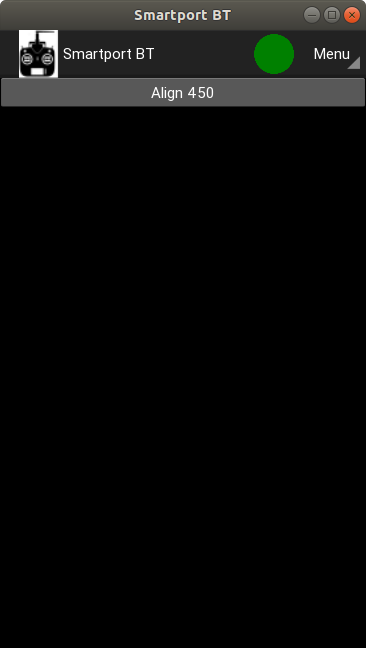
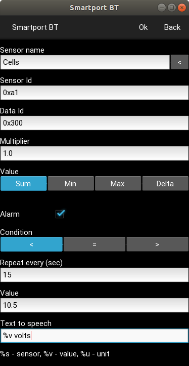

# Smartport bluetooth client

This is a Frsky Smartport client for devices with bluetooth written in Python 3

- Supported OS: Android, Linux, OS X and Windows
- Support for bluetooth 2. Bluetooth 4 (BLE) supported only in Linux
- Support for ACCST X series. ACCST D series and ACCESS protocols not supported

## Installation

## Linux, OS X and Windows

Prerequisites:

- Python 3
- OpentTx 2.3.6

Install python modules

Linux:

*python3 -m pip install kivy pybluez plyer gattlib*

To scan for BLE devices sudo privilieges are needed. To run as normal user change python capabilities:

*sudo setcap cap_net_raw+ep /usr/bin/$(readlink /usr/bin/python3)*

OS X and old windows:

*python -m pip install kivy pybluez plyer*

Windows 10:

*python -m pip install kivy PyBluez-win10 plyer*

Copy folder *src* and execute

*python3 main.py*

## Android

Install *smartportbt_unsigned.apk* 

Pair the bluetooth device before launching the app

## Usage

In Opentx go to *Radio settings -> Hardware -> SP power -> ON*

Attach bluetooth device to radio smartport

 

 

 